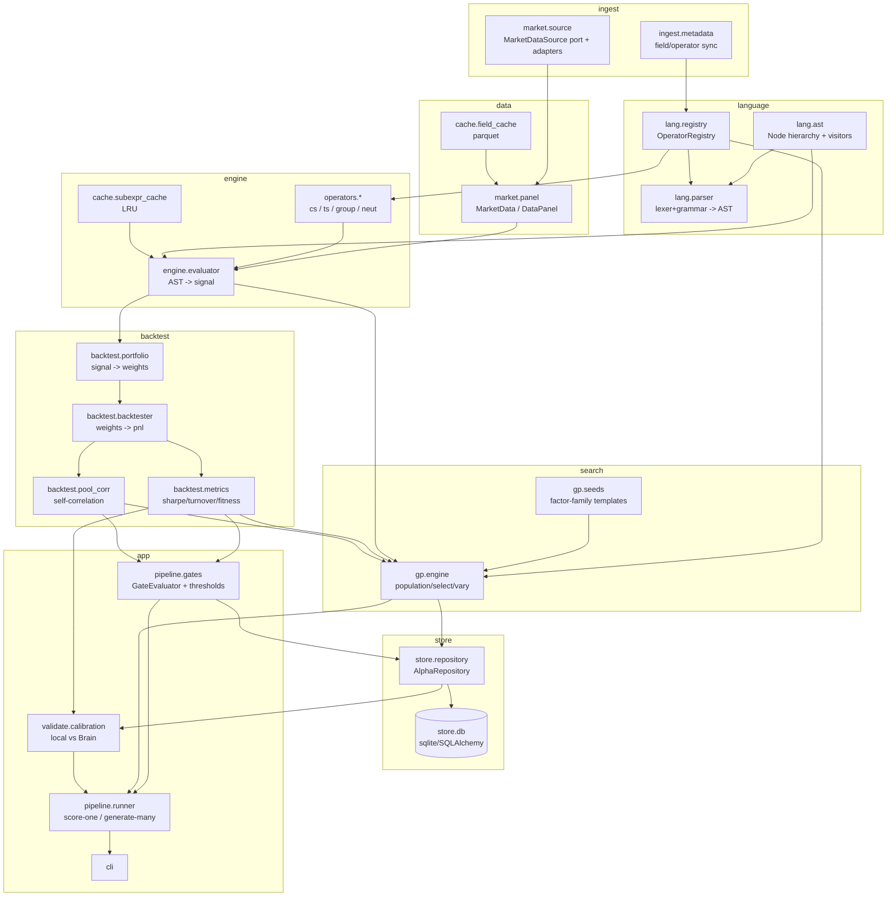

# MiniBrain — Master Design & Build Spec

> **What this document is.** A single source-of-truth design + build plan for *MiniBrain*,
> a local WorldQuant Brain (WQ Brain) research platform. It is written to be executed by
> Claude Code, phase by phase. It contains: (A) analysis of the original `goal.md` /
> `skeleton.md`, (B) a fully detailed, directly-implementable system design, (C) an
> MVP-first phased build plan, (D) engineering rules, and (E) the execution order and the
> per-phase ritual to follow.
>
> **How to use it.** Do not implement everything at once. Follow Part E. For each phase:
> design → explain → implement → review → only then advance. Keep the test suite green.
>
> **Scope reminder.** MiniBrain is a *local pre-filter*, not a clone of WQ Brain. Its value
> is measured by **rank-correlation between local metrics and Brain's actual simulator**,
> and by catching **pool self-correlation** before it costs a submission — *not* by
> reproducing Brain's exact Sharpe. Keep that north star in mind throughout.

---

## Part A — Analysis

### A1. Technical restatement of goals

Build a deterministic, high-throughput **local alpha research engine** for the WQ Brain
TOP3000 US / Delay-1 context that:

1. Ingests **field/operator metadata** from WQ Brain and **point-in-time market data** from
   a pluggable data source, stored columnar (Parquet) and aligned into a `(time × asset)`
   panel.
2. **Parses** FASTEXPR-subset expressions into a typed AST and **evaluates** them
   vectorially over the panel into a signal `(T × N)`.
3. Runs a **WQ-faithful portfolio + backtest** (neutralization, decay, truncation, scale,
   delay-1) and computes **Sharpe, Turnover, Returns, Drawdown, Fitness, per-year Sharpe**.
4. Computes **PnL self-correlation against a stored pool** of already-passed/submitted
   alphas — the dominant real submission blocker — entirely locally and quota-free.
5. **Generates** candidate alphas at scale via Genetic Programming with
   **correlation-aware, regime-aware** selection, persisting every outcome (including
   failures) to a research database.
6. **Ranks and de-duplicates** candidates and surfaces a short, decorrelated short-list to
   simulate on Brain.

The success criterion is explicitly **relative**: MiniBrain should reject 80–95% of weak
alphas and flag saturated/correlated ones *before* a Brain simulation is spent, and its
local ordering of alphas should correlate strongly (target Spearman ρ ≳ 0.6 on Sharpe with
Brain on a held-out set) with Brain's. It is a *filter*, validated by a calibration
harness — not an oracle.

### A2. System components (decomposition)

| Layer | Component | Responsibility |
|---|---|---|
| Ingest | `MetadataSync` | Pull field/operator catalogs from Brain → local registry/config. |
| Ingest | `MarketDataSource` (pluggable) | Provide PIT prices/volume/fundamentals + universe history + sector groups. |
| Data | `MarketData` / `DataPanel` | Aligned arrays: dates, assets, `field → (T,N)`, universe mask, returns, groups. |
| Lang | `Parser` (lexer + grammar) | FASTEXPR-subset string → typed AST; static validation. |
| Lang | `Expression` AST + visitors | Node hierarchy; depth, hash, fields, complexity, serialization. |
| Lang | `OperatorRegistry` | Single source of truth: operator specs (arity/types/impl/category/GP-flags). |
| Eval | `Evaluator` | Walk AST → signal `(T,N)`, with sub-expression caching. |
| Sim | `PortfolioBuilder` | signal → weights `(T,N)` via a `PortfolioConfig` (neut/decay/trunc/scale/delay). |
| Sim | `Backtester` | weights + returns → daily PnL + equity curve (delay-1). |
| Sim | `MetricsCalculator` | PnL/weights → Sharpe, Turnover, Returns, Drawdown, Fitness, per-year. |
| Sim | `PoolCorrelation` | candidate PnL vs stored pool PnL vectors → max |ρ|. |
| Gate | `GateEvaluator` | Soft scores + hard gates (syntax, depth, self-corr, concentration). |
| Validate | `CalibrationHarness` | Local-vs-Brain correlation report on already-simulated alphas. |
| Search | `GPEngine` | Population, init/seed, fitness, selection, variation, evolution loop. |
| Store | `AlphaRepository` / DB | Persist expressions, metrics, PnL vectors, pool, dead fields, caches. |
| Store | `CacheLayer` | Field cache (parquet), sub-expression cache (LRU), result cache (DB). |
| App | `pipeline` / CLI | Orchestrate score-one and generate-many flows; emit the short-list. |

### A3. Gaps in the current design (`goal.md` + `skeleton.md`)

These are the things the original skeleton omits or under-specifies. They are ordered by
how badly they threaten the project's value.

1. **No local↔Brain correlation validation (the whole point is unverified).** The skeleton
   acknowledges it "can't reproduce Brain's Sharpe" but never builds the harness that
   *measures* how well local ordering tracks Brain. Without it you cannot know whether the
   filter is helpful, useless, or actively harmful (silently discarding alphas that would
   have passed). **This must be a first-class component**, not a footnote.

2. **Pool self-correlation is absent — yet it is the real submission blocker.** The
   skeleton ranks by Sharpe/Fitness and de-dups only by **AST hashing** (structural). But
   structural similarity ≠ PnL correlation, and the dominant gate on a mature pool is
   **PnL self-corr ≤ 0.70 against your existing pool**. This is exactly where a *local*
   backtester is uniquely valuable: it can compute PnL correlation against your pool for
   free, without quota. Omitting it means MiniBrain will happily rank a saturated alpha #1.

3. **The data problem is hand-waved.** "DataField Fetcher" implies Brain hands you the
   historical *values*. It does not — Brain's API exposes field/operator **metadata**, not
   the aligned PIT time-series for the TOP3000 universe. You must **bring your own market
   data** that matches Brain's universe membership history, delay convention, and PIT
   reporting. Data fidelity is the upstream determinant of correlation fidelity. This is
   the hardest, most under-scoped part of the project.

4. **GP will Goodhart the local fitness.** Optimizing GP purely on local Fitness overfits
   to (a) the in-sample window, (b) the backtester's idiosyncrasies, and (c) produces a
   population of thousands of *mutually correlated* alphas — industrializing the exact
   saturation failure that kills submissions. The skeleton's fitness has no deflation, no
   per-year robustness, no complexity penalty, and no diversity/novelty pressure.

5. **Operator semantics are assumed, not pinned to WQ.** Naive pandas `rank`/`ts_mean`
   diverge from FASTEXPR in NaN handling, `ts_rank` normalization, `group_neutralize`,
   delay application, and decay weighting. Small mismatches compound into low correlation.
   Operators must be specified against WQ semantics (see B5/B6).

6. **Survivorship / look-ahead bias is unaddressed.** TOP3000 membership changes over
   time. Backtesting on *current* membership, or using `ts_backfill`-able fundamentals
   without PIT discipline, injects look-ahead and inflates local Sharpe — destroying
   correlation with Brain.

7. **`Fitness` formula uses CAGR.** The skeleton's `sharpe·√(|cagr|/max(turn,0.125))`
   should use **annualized returns**, not CAGR, to track Brain's approximation more closely
   — and in any case must be treated as **relative ranking only** until calibrated.

8. **Stage separation is not enforced.** The skeleton lets GP emit fully-wrapped
   expressions. WQ best practice (and depth budget ≈7) requires **expression search ≠
   configuration search**: search bare signal cores; apply neutralization/decay/truncation
   as a separate config stage. Mixing them wastes depth and confounds attribution.

9. **Tech stack is over-engineered for an MVP.** `numba` + `ray` + `deap` up front adds
   build risk before anything runs end-to-end. Defer them (see A5).

### A4. Technical risks

| # | Risk | Impact | Mitigation |
|---|---|---|---|
| R1 | Local metrics don't correlate with Brain | Filter is useless/harmful | `CalibrationHarness` (Phase 4.5); ship only if ρ clears a bar; tune data/operators against it. |
| R2 | Market data doesn't match Brain's PIT/universe | Low correlation, look-ahead | Pluggable `MarketDataSource`; encode universe-membership history; PIT fundamentals; document the source's conventions. |
| R3 | Survivorship / look-ahead bias | Inflated Sharpe, poor generalization | Per-day universe mask; strict "data ≤ t" evaluation; `ts_backfill` only over PIT-valid history. |
| R4 | GP overfits + breeds correlated clones | Saturated short-list, wasted submissions | Deflated Sharpe, per-year robustness, complexity penalty, **NSGA-II / fitness-sharing** with PnL-correlation as an objective. |
| R5 | Operator semantic drift from FASTEXPR | Systematic metric bias | Pin semantics in B6; golden-value tests vs a few Brain-simulated references. |
| R6 | GP bloat / invalid trees | Slow, many wasted evals | Depth cap (≈7), typed crossover/mutation, validity repair, hoist mutation, canonical-hash dedup. |
| R7 | Performance: 10k+ alphas/day | Throughput target missed | Vectorized panel eval + **sub-expression cache** + **result cache**; parallel via joblib; defer numba until profiled. |
| R8 | Non-determinism (seeds, ordering) | Irreproducible research | Global seed control; deterministic canonicalization; record seeds in DB. |
| R9 | Fitness/threshold numbers drift per competition | Stale gates | Centralize thresholds in one config module; never hardcode at call sites. |

### A5. Proposed (revised) architecture & rationale

Keep the skeleton's spine (fetch → parse → evaluate → backtest → metrics → DB → GP →
select) but **add the three missing first-class concerns** and **simplify the stack for
MVP**:

- **Add `PoolCorrelation`** as a core gate, not an afterthought (Gap #2). Store the daily
  PnL vector of every passed alpha; compute `max |ρ|` of each candidate against the pool.
- **Add `CalibrationHarness`** (Gap #1) — the validity check for the entire project.
- **Make `MarketDataSource` an explicit pluggable port** (Gap #3, R2): MiniBrain depends on
  an interface, not on Brain returning data. Ship a real adapter for whatever feed you
  have; the rest of the system is source-agnostic.
- **Enforce stage separation** (Gap #8): GP searches **cores**; `PortfolioConfig` carries
  neutralization/decay/truncation/scale/delay applied in the config stage.
- **Correlation- and regime-aware GP fitness** (Gap #4): multi-objective selection.
- **Stack for MVP:** `numpy` + `pandas` + `pyarrow` for data; **vectorized panel evaluator**
  (a `dict[str, np.ndarray (T,N)]`) as the speed lever, *not* numba; `joblib` for
  parallelism (single machine is plenty for 10k/day); `lark` for the parser; `sqlite` via
  SQLAlchemy Core. **Defer**: `numba` (only after profiling shows a hot loop), `ray`
  (only when you outgrow one machine), `deap` (a small hand-rolled typed GP gives tighter
  control over typing + the multi-objective fitness; adopt `deap`'s NSGA-II only if the
  hand-rolled selector becomes a bottleneck).

**Why GP is appropriate *here* (and was removed elsewhere).** In the online refinement
pipeline, GP was dropped because *simulation quota* was the binding constraint and GP is
sample-inefficient. MiniBrain removes that constraint — local evaluation is cheap — so GP's
sample-inefficiency is acceptable and its breadth is an asset. **However**, the hard-won
lesson still holds in full: a Sharpe-greedy search produces a *saturated, mutually
correlated* population. So **correlation-aware selection is mandatory**, not optional — it
is wired into the GP fitness from day one (R4).

---

## Part B — Detailed Design

### B1. Module dependency graph



**Dependency rule:** arrows point from dependency → dependent only within a layer or
downward. `lang`, `operators`, `engine`, `backtest` must **not** import from `gp`, `store`,
or `app`. Orchestration (`pipeline`) is network-agnostic and takes the data source +
repository as injected dependencies (testable with fakes).

### B2. Folder structure

```
minibrain/
├── pyproject.toml                 # py3.12, deps, ruff/mypy/pytest config
├── README.md
├── config/
│   ├── settings.py                # paths, seeds, run config (pydantic-settings)
│   └── thresholds.py              # ALL submission/gate numbers in ONE place (Gap #7/R9)
├── minibrain/
│   ├── __init__.py
│   ├── market/
│   │   ├── source.py              # MarketDataSource Protocol (port)
│   │   ├── adapters/
│   │   │   └── parquet_source.py  # concrete adapter over your data feed
│   │   ├── panel.py               # MarketData / DataPanel
│   │   └── universe.py            # per-day membership mask, sector groups
│   ├── ingest/
│   │   ├── metadata.py            # sync field/operator catalogs from Brain
│   │   └── brain_client.py        # thin httpx REST client (metadata only)
│   ├── lang/
│   │   ├── ast.py                 # Node hierarchy + visitors
│   │   ├── registry.py            # OperatorRegistry + OperatorSpec + @register
│   │   ├── grammar.lark           # FASTEXPR-subset grammar
│   │   └── parser.py              # lark transformer -> AST + static validation
│   ├── operators/
│   │   ├── arithmetic.py          # + - * / log abs sign power max min
│   │   ├── cross_sectional.py     # rank, winsorize, scale, zscore
│   │   ├── timeseries.py          # ts_mean/std/delta/delay/rank/zscore/corr/decay/backfill
│   │   ├── group.py               # group_neutralize
│   │   ├── neutralization.py      # regression_neut, vector_neut
│   │   └── conditional.py         # trade_when, hump
│   ├── engine/
│   │   └── evaluator.py           # Evaluator (visitor) + sub-expression cache hook
│   ├── backtest/
│   │   ├── config.py              # PortfolioConfig (neut/decay/trunc/scale/delay)
│   │   ├── portfolio.py           # PortfolioBuilder: signal -> weights
│   │   ├── backtester.py          # Backtester: weights -> pnl/equity (delay-1)
│   │   ├── metrics.py             # MetricsCalculator + AlphaMetrics
│   │   └── pool_corr.py           # PoolCorrelation
│   ├── cache/
│   │   ├── field_cache.py         # parquet read/write, partitioned
│   │   ├── subexpr_cache.py       # in-run LRU keyed by canonical node hash
│   │   └── result_cache.py        # DB-backed expr-hash -> metrics
│   ├── store/
│   │   ├── db.py                  # engine, schema, migrations
│   │   ├── models.py              # table definitions (SQLAlchemy Core)
│   │   └── repository.py          # AlphaRepository (CRUD + pool + dead-fields)
│   ├── gp/
│   │   ├── individual.py          # wraps an Expression + cached fitness vector
│   │   ├── seeds.py               # economically-grounded template seeds (factor families)
│   │   ├── init.py                # ramped half-and-half + seeding
│   │   ├── variation.py           # typed crossover, mutation (point/subtree/hoist)
│   │   ├── fitness.py             # multi-objective fitness vector
│   │   ├── selection.py           # NSGA-II / fitness-sharing (correlation-aware)
│   │   └── engine.py              # GPEngine evolution loop
│   ├── pipeline/
│   │   ├── gates.py               # GateEvaluator (soft scores + hard gates)
│   │   ├── runner.py              # score_one(), generate_many()
│   │   └── shortlist.py           # rank + decorrelate -> final candidates
│   ├── validate/
│   │   └── calibration.py         # CalibrationHarness (local vs Brain)
│   └── cli.py                     # entrypoints
└── tests/
    ├── conftest.py                # fixtures incl. a small REAL data panel
    ├── unit/                      # per-module
    ├── golden/                    # operator golden values vs Brain references
    └── integration/               # parse->eval->backtest->metrics end-to-end
```

### B3. Core domain model & class design

Type aliases (define once, e.g. in `minibrain/types.py`):

```python
import numpy as np
import numpy.typing as npt

Panel = npt.NDArray[np.float64]   # shape (T, N); NaN = missing / out-of-universe
Mask  = npt.NDArray[np.bool_]     # shape (T, N); True = in universe that day
Dates = npt.NDArray[np.datetime64]
Assets = npt.NDArray[np.str_]
```

```python
# minibrain/market/panel.py
from dataclasses import dataclass, field

@dataclass(frozen=True, slots=True)
class MarketData:
    """Immutable aligned panel. All field arrays share (T, N) shape and the same
    date/asset axes. `universe` is the per-day membership mask (look-ahead-safe)."""
    dates: Dates                       # (T,)
    assets: Assets                     # (N,)
    fields: dict[str, Panel]           # name -> (T, N)
    universe: Mask                     # (T, N)
    returns: Panel                     # (T, N) close-to-close simple returns
    groups: dict[str, npt.NDArray]     # e.g. "sector" -> (T, N) int codes

    def field(self, name: str) -> Panel: ...
    def years(self) -> dict[int, slice]: ...   # row slices per calendar year
    def __post_init__(self) -> None: ...        # validate shapes, axis alignment
```

```python
# minibrain/market/source.py
from typing import Protocol

class MarketDataSource(Protocol):
    """Port. MiniBrain depends on THIS, never on a concrete feed. The adapter is
    responsible for PIT correctness, universe-membership history, and delay convention."""
    def load(self, start: str, end: str, universe: str = "TOP3000") -> MarketData: ...
    def available_fields(self) -> list[str]: ...
```

### B4. Expression AST design

A small sealed hierarchy with a visitor protocol. The AST distinguishes **panel-valued
arguments** (sub-expressions) from **scalar literal parameters** (window ints,
thresholds), because operators have mixed signatures (`ts_mean(panel, int) -> panel`).

```python
# minibrain/lang/ast.py
from __future__ import annotations
from abc import ABC, abstractmethod
from dataclasses import dataclass
from typing import Protocol, TypeVar

T = TypeVar("T")

class NodeVisitor(Protocol[T]):
    def visit_constant(self, node: Constant) -> T: ...
    def visit_field(self, node: Field) -> T: ...
    def visit_call(self, node: Call) -> T: ...

class Node(ABC):
    @abstractmethod
    def accept(self, v: NodeVisitor[T]) -> T: ...
    @abstractmethod
    def children(self) -> tuple[Node, ...]: ...

@dataclass(frozen=True, slots=True)
class Constant(Node):
    value: float
    def accept(self, v): return v.visit_constant(self)
    def children(self): return ()

@dataclass(frozen=True, slots=True)
class Field(Node):
    name: str
    def accept(self, v): return v.visit_field(self)
    def children(self): return ()

@dataclass(frozen=True, slots=True)
class Call(Node):
    op: str                       # must exist in OperatorRegistry
    args: tuple[Node, ...]        # positional; scalars are Constant nodes
    def accept(self, v): return v.visit_call(self)
    def children(self): return self.args
```

**Visitors (each a separate class, single responsibility):**

- `DepthVisitor -> int` — max tree depth; used to enforce the ≈7 cap (config wrappers count).
- `FieldCollector -> set[str]` — fields referenced (validation + dead-field check).
- `CanonicalHasher -> str` — stable hash after canonicalization (commutative-arg sort,
  literal normalization). Drives sub-expression cache + result cache + dedup.
- `ComplexityVisitor -> int` — node count / weighted complexity for the GP penalty.
- `Serializer -> str` — AST → canonical FASTEXPR string (round-trips with the parser).
- `Evaluator -> Panel` — the heavy one (B6).

**Why a sealed hierarchy + visitors:** open/closed — new analyses are new visitors, not
edits to node classes; and evaluation, hashing, validation never tangle.

### B5. Operator registry design

One registry is the **single source of truth** consumed by the parser (validate
op/arity), the evaluator (dispatch), and the GP (type-correct tree construction).

```python
# minibrain/lang/registry.py
from dataclasses import dataclass
from enum import Enum, auto
from typing import Callable

class ArgKind(Enum):
    PANEL = auto()      # a sub-expression evaluating to (T, N)
    WINDOW = auto()     # positive int lookback
    SCALAR = auto()     # float literal (threshold, std count, scale target)
    GROUP = auto()      # a group key name (e.g. "sector")

class OpCategory(Enum):
    ARITHMETIC = auto(); CROSS_SECTIONAL = auto(); TIME_SERIES = auto()
    GROUP = auto(); NEUTRALIZATION = auto(); CONDITIONAL = auto(); SCALING = auto()

@dataclass(frozen=True, slots=True)
class OperatorSpec:
    name: str
    category: OpCategory
    signature: tuple[ArgKind, ...]              # positional arg kinds
    impl: Callable[..., Panel]                  # (ctx, *evaluated_args) -> Panel
    bounded: bool                               # output bounded? (ts_rank yes, ts_zscore no)
    depth_cost: int = 1                         # wrappers may cost differently
    gp_usable: bool = True                      # exclude config wrappers from core search
    window_choices: tuple[int, ...] = (5, 10, 20, 60, 120)  # GP param sampling
    commutative: bool = False                   # for canonicalization

class OperatorRegistry:
    def __init__(self) -> None: self._ops: dict[str, OperatorSpec] = {}
    def register(self, spec: OperatorSpec) -> None: ...
    def get(self, name: str) -> OperatorSpec: ...
    def by_category(self, c: OpCategory) -> list[OperatorSpec]: ...
    def gp_function_set(self) -> list[OperatorSpec]: ...   # gp_usable only, cores only
```

Operators self-register via decorator so each `operators/*.py` file is independently
importable and the registry is assembled by importing the package:

```python
# minibrain/operators/timeseries.py
@register(name="ts_mean", category=OpCategory.TIME_SERIES,
          signature=(ArgKind.PANEL, ArgKind.WINDOW), bounded=False)
def ts_mean(ctx: EvalContext, x: Panel, d: int) -> Panel: ...
```

**WQ-faithful operator notes to encode (these are correctness, not style):**

- `ts_delay` is the shift op; **there is no `delay`**. `ts_delta(x,d) = x − ts_delay(x,d)`.
- `ts_rank(x,d)` → today's value's rank in the trailing d-window, normalized ~[0,1],
  **bounded** (regime-stable default). `ts_zscore` is **unbounded** — mark `bounded=False`.
- `ts_backfill(x,d)` fills NaN with the last valid value up to `d` back; **mandatory for
  sparse fundamentals**, apply close to the raw field. Price/volume usually don't need it.
- `rank(x)` / `winsorize` / `scale` / `truncate` are **rank/sign preserving** → they
  **cannot** change self-correlation. Tag them so GP and gate logic never reach for them to
  fix correlation.
- `group_neutralize(x, group)` subtracts the per-day group mean (removes group-mean
  exposure only). It is a **wrapper** (config stage), `gp_usable=False` for core search.
- `regression_neut(y, x)` = per-day cross-sectional residual of y on x.
  `vector_neut(x, y)` = remove projection of x onto y. **These two are the only operators
  that reduce self-correlation.** Reserve them for the config/decorrelation stage and the
  GP's correlation objective.
- `trade_when(trigger, alpha, exit)` is the primary conditioning lever (volume/event
  gating) — where non-obvious edge actually comes from. `hump(x, thr)` lowers turnover;
  **never apply to a fast signal whose turnover is the alpha**.

### B6. Evaluation engine

```python
# minibrain/engine/evaluator.py
@dataclass(frozen=True, slots=True)
class EvalContext:
    data: MarketData
    registry: OperatorRegistry
    cache: SubexprCache | None

class Evaluator(NodeVisitor[Panel]):
    def __init__(self, ctx: EvalContext) -> None: ...
    def evaluate(self, node: Node) -> Panel:
        # 1) canonical-hash the node; 2) cache hit -> return; 3) dispatch; 4) cache put
        ...
    def visit_constant(self, n: Constant) -> Panel: ...   # broadcast to (T, N)
    def visit_field(self, n: Field) -> Panel: ...         # data.field(name), masked
    def visit_call(self, n: Call) -> Panel:
        spec = self.ctx.registry.get(n.op)
        eval_args = [self.evaluate(a) if k is ArgKind.PANEL else _literal(a)
                     for a, k in zip(n.args, spec.signature)]
        out = spec.impl(self.ctx, *eval_args)
        return _apply_universe_mask(out, self.ctx.data.universe)  # NaN outside universe
```

**Invariants (these protect correlation with Brain — R5/R3):**

- Out-of-universe cells are **NaN**, never 0; every op must NaN-propagate correctly.
- All cross-sectional ops operate **per-row over the in-universe cells only**.
- Time-series ops use only data at rows ≤ t (no look-ahead); insufficient history → NaN.
- Sub-expression cache is keyed by **canonical node hash** — GP populations share subtrees
  heavily, so this is the main throughput win (R7) before any numba.

### B7. Portfolio & backtest architecture

Stage separation is **enforced here**: the AST is the bare **signal core**; everything WQ
calls "settings" lives in `PortfolioConfig` and is applied in the config stage.

```python
# minibrain/backtest/config.py
class Neutralization(Enum):
    NONE = auto(); MARKET = auto(); SECTOR = auto(); INDUSTRY = auto(); SUBINDUSTRY = auto()

@dataclass(frozen=True, slots=True)
class PortfolioConfig:
    neutralization: Neutralization = Neutralization.SECTOR
    decay: int = 0                 # ts_decay_linear window over the signal; 0 = off
    truncation: float = 0.10       # cap per-name |weight| (weight concentration gate)
    scale_book: float = 1.0        # sum(|w|) target
    delay: int = 1                 # delay-1: trade on next day's bar
```

```python
# minibrain/backtest/portfolio.py
class PortfolioBuilder:
    def build(self, signal: Panel, cfg: PortfolioConfig, data: MarketData) -> Panel:
        # 1) optional decay (smoothing) — SKIP for fast signals (turnover is the alpha)
        # 2) neutralize: demean cross-sectionally; if SECTOR/etc subtract group means
        # 3) truncate: cap |w_i| at `truncation` of the book, renormalize
        # 4) scale: w /= sum(|w|); w *= scale_book   (dollar-neutral long-short)
        # 5) delay: weights at t are applied to returns at t+delay
        ...
```

```python
# minibrain/backtest/backtester.py
@dataclass(frozen=True, slots=True)
class BacktestResult:
    daily_pnl: npt.NDArray[np.float64]      # (T,)
    equity_curve: npt.NDArray[np.float64]   # (T,)
    weights: Panel                          # (T, N) (delayed)

class Backtester:
    def run(self, weights: Panel, data: MarketData) -> BacktestResult:
        # pnl_t = nansum(weights_{t-delay} * returns_t over assets)
        ...
```

### B8. Metrics & gates

```python
# minibrain/backtest/metrics.py
@dataclass(frozen=True, slots=True)
class AlphaMetrics:
    sharpe: float
    annual_return: float
    turnover: float
    max_drawdown: float
    fitness: float
    per_year_sharpe: dict[int, float]       # regime robustness (first-class)
    weight_concentration: float             # max single-name |weight| share

class MetricsCalculator:
    PERIODS_PER_YEAR = 252
    TURNOVER_FLOOR = 0.125
    def compute(self, bt: BacktestResult, data: MarketData) -> AlphaMetrics:
        # sharpe   = mean(pnl)/std(pnl) * sqrt(252)
        # turnover = mean_t sum_i |w_t - w_{t-1}|      (relative proxy)
        # fitness  = sharpe * sqrt(|annual_return| / max(turnover, TURNOVER_FLOOR))
        #   ^ Brain's exact formula is not public; treat as RELATIVE ranking only.
        ...
```

```python
# minibrain/pipeline/gates.py — gate numbers come ONLY from config/thresholds.py
@dataclass(frozen=True, slots=True)
class GateVerdict:
    passed: bool
    hard_failures: list[str]      # depth>cap, dead field, self_corr>=0.70, concentration
    soft_scores: dict[str, float] # sharpe/fitness/turnover-band/per-year/correlation

class GateEvaluator:
    def evaluate(self, m: AlphaMetrics, self_corr: float, depth: int,
                 fields_ok: bool) -> GateVerdict: ...
```

**Hard gates** (binary, block): syntax/type/arity, depth ≤ cap, every field valid,
**PnL self-corr < 0.70**, weight concentration ≤ cap. **Soft scores** (tradable in
search): Sharpe (deflated), Fitness, turnover within band, per-year-Sharpe min, pool
correlation. This matches the soft-penalty-by-default / hard-gate-for-true-blockers
principle.

### B9. Pool correlation — the killer feature

The single highest-leverage thing MiniBrain can do that Brain can't do for free.

```python
# minibrain/backtest/pool_corr.py
class PoolCorrelation:
    """Max |Pearson ρ| of a candidate's daily PnL against every passed alpha's stored
    PnL vector, aligned on common dates. This is a LOCAL PROXY for Brain's self-corr
    gate — useful and quota-free, but the platform's checker is authoritative
    pre-submission (it can diverge)."""
    def __init__(self, pool_pnls: dict[int, npt.NDArray[np.float64]]) -> None: ...
    def max_corr(self, candidate_pnl: npt.NDArray[np.float64],
                 dates: Dates) -> tuple[float, int | None]:  # (max|ρ|, worst_alpha_id)
        ...
```

The pool is materialized from the DB (every passed alpha stores its PnL vector). New
passes append. The GP uses `max_corr` both against the **pool** and against the **current
population** to keep candidates decorrelated (B13).

### B10. Calibration harness

The validity check for the *entire project*. Without it, MiniBrain is unfalsifiable.

```python
# minibrain/validate/calibration.py
@dataclass(frozen=True, slots=True)
class CalibrationReport:
    n: int
    spearman_sharpe: float         # local vs Brain Sharpe rank-corr (the headline number)
    spearman_fitness: float
    self_corr_agreement: float     # fraction where local/Brain agree on the 0.70 gate
    decile_hit_rate: float         # of Brain top-decile, how many local also top-decile
    by_year: dict[int, float]

class CalibrationHarness:
    """Feed a CSV/DB of already-Brain-simulated alphas (expression + Brain metrics).
    Re-score locally, report rank-correlation. Gate the whole tool on a minimum ρ."""
    def run(self, brain_records: list[BrainRecord]) -> CalibrationReport: ...
```

**Operational rule:** do not trust MiniBrain's ranking until `spearman_sharpe` clears an
agreed bar (e.g. ≥ 0.5–0.6) on a held-out set of ≥ ~50 alphas. If it doesn't, the fix is
upstream (data fidelity, operator semantics), not more GP.

### B11. Database schema

SQLite (SQLAlchemy Core) for the MVP; the schema ports cleanly to Postgres later.

```sql
-- Canonical, de-duplicated expressions
CREATE TABLE expression (
    id              INTEGER PRIMARY KEY,
    canonical_hash  TEXT NOT NULL UNIQUE,     -- CanonicalHasher output
    expr_string     TEXT NOT NULL,            -- canonical FASTEXPR
    depth           INTEGER NOT NULL,
    complexity      INTEGER NOT NULL,
    fields_json     TEXT NOT NULL,            -- referenced fields
    created_at      TIMESTAMP DEFAULT CURRENT_TIMESTAMP
);

-- One evaluation outcome (a given expression under a given PortfolioConfig + data window)
CREATE TABLE evaluation (
    id              INTEGER PRIMARY KEY,
    expression_id   INTEGER NOT NULL REFERENCES expression(id),
    config_json     TEXT NOT NULL,            -- PortfolioConfig
    data_window     TEXT NOT NULL,            -- start..end, universe
    sharpe          REAL, annual_return REAL, turnover REAL,
    max_drawdown    REAL, fitness REAL, weight_concentration REAL,
    per_year_json   TEXT,                     -- {year: sharpe}
    self_corr_max   REAL,                     -- vs pool at eval time
    status          TEXT NOT NULL,            -- 'passed'|'failed_gate'|'invalid'|'error'
    fail_reasons    TEXT,                     -- hard_failures, for the avoid-list
    seed            INTEGER,                  -- reproducibility (R8)
    created_at      TIMESTAMP DEFAULT CURRENT_TIMESTAMP,
    UNIQUE(expression_id, config_json, data_window)
);

-- Daily PnL vectors of PASSED alphas -> the local self-correlation pool (B9)
CREATE TABLE pool_pnl (
    evaluation_id   INTEGER PRIMARY KEY REFERENCES evaluation(id),
    dates_blob      BLOB NOT NULL,            -- packed datetimes
    pnl_blob        BLOB NOT NULL             -- packed float64 (T,)
);

-- Fields rejected by Brain -> never propose again (self-learning dead zones)
CREATE TABLE dead_field (
    name        TEXT PRIMARY KEY,
    reason      TEXT,
    created_at  TIMESTAMP DEFAULT CURRENT_TIMESTAMP
);

-- Brain-simulated ground truth for the calibration harness (B10)
CREATE TABLE brain_record (
    id              INTEGER PRIMARY KEY,
    expr_string     TEXT NOT NULL,
    brain_sharpe    REAL, brain_fitness REAL, brain_turnover REAL,
    brain_self_corr REAL, submitted INTEGER, created_at TIMESTAMP
);

CREATE INDEX idx_eval_expr   ON evaluation(expression_id);
CREATE INDEX idx_eval_status ON evaluation(status);
CREATE INDEX idx_eval_sharpe ON evaluation(sharpe);
```

`AlphaRepository` wraps this with typed methods: `upsert_expression`, `record_evaluation`,
`load_pool()`, `add_dead_field`, `result_cache_get/put`, `top_n(...)`. **Persist failures,
not just successes** — they power the avoid-list and the dead-field blacklist.

### B12. Cache architecture

Three tiers, each with a distinct lifetime:

1. **Field cache** (`cache/field_cache.py`) — raw market data as **partitioned Parquet**
   (immutable, large). Loaded once into `MarketData`. Never CSV (slower, RAM-heavy).
2. **Sub-expression cache** (`cache/subexpr_cache.py`) — in-memory **LRU** keyed by
   canonical node hash, scoped to one GP run. The main throughput lever (R7): populations
   reuse subtrees, so identical sub-panels are computed once.
3. **Result cache** (`cache/result_cache.py`) — DB-backed `canonical_hash + config +
   window → AlphaMetrics`. Re-scoring a known alpha is free; GP dedup hits here first.

Canonicalization (commutative-arg sorting, window/literal normalization) raises hit rates
across all three. Sub-expression cache holds **panels**; result cache holds **metrics**.

### B13. Genetic Programming architecture

```python
# minibrain/gp/fitness.py  — multi-objective, correlation- & regime-aware (R4)
@dataclass(frozen=True, slots=True)
class FitnessVector:
    sharpe_deflated: float          # local Sharpe minus a multiple-testing haircut
    per_year_min_sharpe: float      # regime robustness (worst year)
    turnover_penalty: float         # distance outside the target band
    complexity_penalty: float       # node count / depth pressure (anti-bloat)
    pool_corr_penalty: float        # max|ρ| vs existing pool  (saturation pressure)
    pop_corr_penalty: float         # max|ρ| vs rest of population (diversity pressure)
```

- **Representation:** the typed AST (B4). Scalar params (`WINDOW`/`SCALAR`) are `Constant`
  leaves the GP perturbs; `PANEL` args are sub-trees.
- **Initialization:** ramped half-and-half **seeded** with economically-grounded templates
  from `gp/seeds.py` (factor-family cores) — pure random GP wastes most evaluations on
  garbage. Seeds steer toward valid, hypothesis-shaped structures.
- **Function set:** `registry.gp_function_set()` — **cores only**. Config wrappers
  (`group_neutralize`, `ts_decay_linear`, `scale`) are excluded from the core search and
  applied later via `PortfolioConfig` (stage separation; protects the depth budget).
- **Constraints:** depth cap ≈7; typed crossover/mutation (only swap type-compatible
  subtrees / same-signature operators / valid window choices); validity repair; canonical-
  hash dedup against population + DB.
- **Variation:** subtree crossover, point mutation (op swap / field swap / window perturb),
  subtree mutation, **hoist mutation** (lift a subtree to fight bloat).
- **Selection:** **correlation-aware multi-objective** — NSGA-II Pareto fronts over the
  `FitnessVector`, or fitness-sharing/crowding. This is what stops the population
  collapsing into 1000 correlated clones of the top-Sharpe alpha (the saturation lesson).
- **Loop:** evaluate (parallel via `joblib`, sub-expression + result caches on) → score →
  select → vary → elitism → next gen. **Every** evaluated individual (pass or fail) is
  persisted (avoid-list, dead fields, reproducible seeds).

```python
# minibrain/gp/engine.py
class GPEngine:
    def __init__(self, registry, evaluator, builder, backtester, metrics,
                 pool_corr, repo, cfg: GPConfig) -> None: ...
    def evolve(self, generations: int) -> list[Individual]: ...   # ranked, decorrelated
```

### B14. End-to-end evaluation pipeline

```
expr string
  └─> parse (lang.parser)                      # -> AST  (syntax/arity error -> reject)
       └─> canonicalize + hash                 # result-cache lookup -> HIT? return metrics
            └─> static validate                # depth<=cap, fields valid (else hard fail)
                 └─> evaluate (engine)         # -> signal (T,N), subexpr-cache on
                      └─> build portfolio      # PortfolioConfig: neut/decay/trunc/scale/delay
                           └─> backtest        # -> daily PnL, equity (delay-1)
                                └─> metrics    # sharpe/turnover/fitness/per-year/concentration
                                     └─> pool corr   # max|ρ| vs pool
                                          └─> gates  # soft scores + hard gates
                                               └─> persist (repo)  # pass/fail + PnL if passed
```

`pipeline.runner.score_one(expr, cfg)` returns `(AlphaMetrics, GateVerdict)`.
`pipeline.runner.generate_many(...)` drives the GP and emits a ranked, decorrelated
short-list via `pipeline.shortlist`.

---

## Part C — Phased build plan (MVP-first)

> The earliest valuable running thing (the **MVP milestone**) is **Phases 1–3**: parse a
> hand-written FASTEXPR alpha → evaluate → backtest → read a Sharpe and an equity curve on
> real data. Everything before that exists to make that possible; everything after makes
> it trustworthy and automatic. Complexity scale: **S < M < L < XL**.

| Phase | Objective | Output | Depends on | Complexity |
|---|---|---|---|---|
| **0** Data foundation | Repo scaffold + a loadable real panel | `MarketData` from a small real window via the parquet adapter; universe mask; returns; sector groups | — | **M** (data wrangling is the real cost) |
| **1** Parser | FASTEXPR-subset → typed AST + static validation | `parse(str) -> Node`; depth/field/serialize visitors; registry skeleton | 0 | **M** |
| **2** Operator Engine | Implement operators + evaluate AST → signal | `operators/*`, `Evaluator`; signal `(T,N)` on real data; golden tests | 1 | **L** |
| **3** Backtester | Portfolio + PnL (delay-1) | `PortfolioBuilder`, `Backtester`; equity curve from a hand-written alpha **← MVP** | 2 | **M** |
| **4** Metrics + Gates | Full metric table + verdict | `MetricsCalculator`, `GateEvaluator`, `config/thresholds.py` | 3 | **M** |
| **4.5** Calibration | Validate local vs Brain | `CalibrationHarness` + `CalibrationReport`; ρ gate on the tool itself | 4 + `brain_record` data | **M** (highest value-per-line) |
| **5** Database | Durable research store + caches | schema, `AlphaRepository`, result cache, `pool_pnl`, dead fields | 4 | **M** |
| **6** Pool correlation | Local self-corr gate wired in | `PoolCorrelation` reading the pool from DB; gate uses it | 5 | **S** |
| **7** GP Engine | Automated generation at scale | seeds, init, variation, multi-objective fitness, NSGA-II selection, `GPEngine`; persists all outcomes | 5, 6 | **XL** |
| **8** Short-list + CLI | Ranked, decorrelated candidate export | `pipeline.shortlist`, `cli` (`score-one`, `generate`, `calibrate`) | 7 | **S** |
| **9** Dashboard / submit assistant | Inspect runs, push short-list | reporting UI / export; optional Brain submit helper | 8 | **M** |

**Ordering note vs. the original brief.** The brief's coding order is
Parser → Operator Engine → Backtester → Metrics → Database → GP. This plan follows it,
inserting **Phase 0** (nothing runs without data) and **Phase 4.5 Calibration** (the
project is unfalsifiable without it). Database lands at Phase 5 as requested; a *thin*
result-cache table may be pulled forward into Phase 4 if convenient, but the full schema is
Phase 5.

---

## Part D — Implementation rules (working agreement)

1. **Production-ready code.** No demo/throwaway code. No mocks unless a real dependency is
   genuinely unavailable (e.g. the live Brain network) — prefer fakes/fixtures over mocks.
2. **Python 3.12.** Use modern syntax (`match`, `X | None`, `type` aliases, `@dataclass(slots=True)`).
3. **Full type hints** on every public function/method/attribute; `mypy --strict` clean.
4. **SOLID.** One responsibility per class; depend on protocols (`MarketDataSource`,
   `NodeVisitor`), not concretions; the registry/visitor patterns keep things open/closed.
5. **Every module runs independently** — importable in isolation, with a `__main__` or a
   focused test demonstrating it (e.g. `python -m minibrain.lang.parser "rank(close)"`).
6. **Create all files and folders** in the structure (B2); no stubs left dangling on import.
7. **Determinism.** All randomness flows through an injected seed; record the seed in the DB.
8. **No look-ahead / survivorship bias.** Per-day universe mask everywhere; time-series ops
   read only rows ≤ t; PIT discipline on fundamentals. This is a correctness rule, not a nicety.
9. **Thresholds live only in `config/thresholds.py`.** Never hardcode a gate number at a call site.
10. **Tests per phase:** unit tests for the module, golden tests for operator semantics
    (against any Brain-simulated reference values you have), and one integration test that
    runs parse→eval→backtest→metrics. Keep the suite green before advancing.
11. **After creating each file, explain its purpose in 1–2 sentences** (per the brief).
12. **Lint/format** with `ruff`; no unused imports; no dangling references.

---

## Part E — Execution order & per-phase ritual

Implement strictly in this order (the brief's order, with the two justified insertions):

```
Phase 0  Data foundation
Phase 1  Parser
Phase 2  Operator Engine
Phase 3  Backtester            ← MVP end-to-end milestone (stop, demo, review)
Phase 4  Metrics + Gates
Phase 4.5 Calibration          ← gate the whole tool on local↔Brain ρ before trusting it
Phase 5  Database
Phase 6  Pool correlation
Phase 7  GP Engine
Phase 8  Short-list + CLI
Phase 9  Dashboard / submit assistant
```

**Per-phase ritual (do not skip):**

1. **Design** — restate the phase's interfaces/classes from Part B; note any deviation and why.
2. **Implement** — create the files for that phase only. Do **not** code ahead.
3. **Explain** — 1–2 sentences per file on its purpose (rule 11).
4. **Review** — run the phase's tests + the integration test; report metrics/results; list
   any open risks (especially anything touching look-ahead bias or operator fidelity).
5. **Gate** — only after the review is clean, advance to the next phase.

**Do not** code the whole repository in one pass. **Do not** skip the design step. Build it
the way a senior quant engineer ships a first production version: a thin, correct,
end-to-end spine first (Phases 0–3), proven against reality (Phase 4.5), then scaled
(Phases 5–9).
