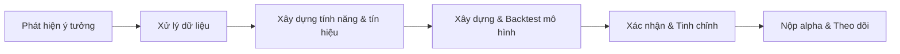

# Báo cáo: Xây dựng Alpha chất lượng cao cho WorldQuant BRAIN Deep Research

## Tóm tắt
Báo cáo này cung cấp hướng dẫn chi tiết để xây dựng một *alpha* (mô hình dự đoán giá) chất lượng cao cho nền tảng WorldQuant BRAIN (Deep Research). Chúng tôi giới thiệu quy trình từ khởi tạo ý tưởng đến nộp bài (submission), bao gồm: **quy định và tiêu chí nộp bài** (định dạng, giới hạn dữ liệu, chỉ số đánh giá, kiểm soát rủi ro, yêu cầu mã), **đặc điểm của alpha tốt** (tính ý nghĩa thống kê, IC/IR, Sharpe, turnover, dung lượng, độ ổn định, phơi nhiễm yếu tố), **nguồn dữ liệu và tiền xử lý** (dữ liệu thị trường, cơ bản, dữ liệu thay thế, loại bỏ thiên lệch, tần suất, chọn rổ cổ phiếu), **thiết kế tính năng và tạo alpha** (căn cứ giá, khối lượng, biến động, phân tích ngang dọc, dùng học máy), **mô hình hóa, backtest và xác nhận** (cross-validation, walk-forward, IS/OOS, tính chi phí giao dịch, slippage, thực thi, tối ưu danh mục), **kiểm tra độ bền và chống overfitting** (đa ngẫu nhiên, bootstrap, PurgedKFold, ổn định IC, kịch bản căng thẳng, phân tích chu kỳ), **triển khai và đóng gói mã** (ngôn ngữ, tái tạo, tài liệu, giới hạn thời gian chạy), **quản lý rủi ro và ước tính dung lượng**, cùng các **ví dụ alpha công khai và tài liệu tham khảo**. 

Báo cáo cũng cung cấp 5 nội dung cụ thể: (1) danh sách công việc (checklist) chi tiết theo bước; (2) bảng ưu tiên các ý tưởng alpha với điểm mạnh/điểm yếu và yêu cầu dữ liệu; (3) đề xuất nguồn dữ liệu ưu tiên (nguồn chính thức); (4) mẫu cấu trúc thư mục cho backtest và nộp bài; (5) các chỉ số đánh giá và ngưỡng nên đặt mục tiêu. Chúng tôi trích dẫn các tài liệu chính thức của WorldQuant (hướng dẫn BRAIN), tài liệu học thuật (ví dụ “101 Alpha” của Kakushadze & Liew) và các nguồn uy tín khác. 

## Quy định nộp bài và tiêu chí đánh giá WorldQuant BRAIN
Nền tảng WorldQuant BRAIN yêu cầu mỗi *alpha* (mô hình) phải được mô phỏng (“simulate”) qua tập dữ liệu thị trường định trước, sau đó mới có thể **Submit** (nộp) để kiểm tra yêu cầu. Các tiêu chí chính bao gồm: **Sharpe ratio**, **IR (Information Ratio)**, **Return (tỷ lệ lợi nhuận)**, **Fitness** (kết hợp Sharpe, Return, Turnover), **turnover**, **giới hạn trọng số (weight)**, và **tự tương quan (self-correlation)** so với các alpha đã có.  

- *Sharpe/IR cao:* Trên nền tảng BRAIN, Sharpe tỷ lệ là chỉ số điều chỉnh rủi ro chính (Sharpe = IR ×√252). Ví dụ, **Sharpe ≥ 2.0** cho Delay-0 (giao dịch cuối ngày) và ≥1.25 cho Delay-1 (giao dịch sáng hôm sau) thường được coi là đáng giá. Vùng **Fitness** (Sharpe ×√(|Return|/max(Turnover,0.125))) càng cao cho thấy alpha tốt hơn. Báo cáo Q&A WorldQuant ghi nhận alpha tốt nên có “P&L ổn định, Sharpe cao, drawdown thấp và turnover vừa phải”.  
- *Turnover và Truncation (giới hạn trọng số):* Nền tảng kiểm tra turnover của alpha nằm trong khoảng hợp lý, ví dụ **1% < Turnover < 70%**. Truncation (cắt bớt) được khuyên đặt từ **5–10%** (giá trị tối đa cho mỗi cổ phiếu trong danh mục) để tránh tập trung quá mức. WorldQuant yêu cầu trọng số tối đa mỗi cổ phiếu thường <10%.  
- *Kiểm soát trọng số:* Bài alpha không được chỉ chọn quá ít cổ phiếu; hệ thống xác minh có đủ cổ phiếu được giao dịch ổn định (số lượng tối thiểu tuỳ theo rổ). Nếu một cổ phiếu chiếm ≥30% cả danh mục là thất bại.  
- *Kiểm tra phân vùng (sub-universe):* Alpha phải thể hiện hiệu suất tương đối trong các phân vùng (nhỏ hơn) của rổ. Yêu cầu: *Sharpe* trên phân vùng ≥ 0.75×√(size_sub/size_alpha)*Sharpe* chung.  
- *Tự tương quan (self-correlation):* Nếu một alpha mới có tương quan cao (>0.7 PnL) với alpha cũ của bạn, thì cần **Sharpe mới ít nhất 10% cao hơn** so với Sharpe cũ để được chấp nhận. Điều này khuyến khích tạo ra alpha mới càng khác biệt càng tốt.  
- *Delay-0 vs Delay-1:* BRAIN phân biệt alpha Delay-0 (dữ liệu cùng ngày) và Delay-1 (dữ liệu ngày hôm trước). Delay-0 thường cho hiệu suất cao hơn nhưng yêu cầu kỹ thuật cũng khắt khe hơn (Sharpe cao hơn, ví dụ >2.6 ở Trung Quốc cho Delay-0 so với >1.625 cho Delay-1).  
- *Chu trình IS/OOS:* Nền tảng dùng 5 năm đầu để huấn luyện (In-Sample) và 2 năm sau (Semi-OS/OS) bị giấu để kiểm định thực tế. Tốt nhất nên chia thêm Train/Test trong IS để tối ưu, và đừng “nộp” ngay khi vượt ngưỡng – cần tiếp tục tinh chỉnh để đạt Performance cao nhưng vẫn giữ low correlation với alpha cũ.  

Bên cạnh đó, code nhập vào phải tuân thủ ngôn ngữ của BRAIN (Fast Expression hoặc Python API), xử lý đúng delay, unit và pasteurization (chỉ dùng dữ liệu trong rổ cổ phiếu). Phải kiểm soát thiên lệch dữ liệu (loại bỏ các biến tương lai, các phép tính sai về đơn vị) nhằm giữ tính hợp lệ. Tóm lại, alpha đủ tiêu chuẩn là tạo ra PnL tăng đều, Sharpe cao, drawdown thấp, turnover vừa phải, trọng số đều và không quá tương quan với alpha đã có.

## Đặc điểm của Alpha “tốt”
Một alpha “tốt” cần có các yếu tố sau:  
- **Ý nghĩa thống kê:** tín hiệu phải có correlation tích cực với lợi nhuận tương lai, measured qua *Information Coefficient* (IC) hoặc *Information Ratio*. IC cao và bền vững cho thấy mô hình có khả năng dự đoán giá đáng tin cậy.  
- **Sharpe/IR cao:** như đã nêu, Sharpe lớn (ví dụ >2.0 cho Delay-0) cho thấy chiến lược có lợi nhuận điều chỉnh rủi ro lớn. IR cao cũng tương đương Sharpe khi nhân √252.  
- **Fitness cao:** WorldQuant định nghĩa Fitness kết hợp Sharpe, lợi nhuận và turnover. Alpha tốt có Fitness cao, đồng nghĩa vừa tăng Sharpe/Return vừa giữ turnover thấp.  
- **Turnover thấp:** giảm tần suất giao dịch giúp giảm chi phí giao dịch. Tốc độ giao dịch cao chỉ khi tín hiệu liên tục và đáng tin cậy.  
- **Drawdown thấp:** đường PnL tích luỹ nên tăng đều, không có các cú sụt giảm lớn. Giảm thiểu *max drawdown* là đánh giá rủi ro quan trọng.  
- **Đa dạng rổ:** alpha “tốt” cần giao dịch đủ nhiều cổ phiếu (không quá tập trung) để đảm bảo hiệu quả. Kiểm tra giới hạn 10% trọng số và thử nghiệm ở các phân đoạn rổ như đã nêu.  
- **Độ bền (robustness):** alpha nên giữ hiệu suất ổn định qua thời gian và khi dùng dữ liệu khác (không chỉ khi huấn luyện). Các phép toán kỹ thuật (ví dụ decay, neutralization) nhằm giảm nhiễu cũng được khuyến khích.  
- **Phơi nhiễm yếu tố:** một alpha tốt nên không dựa quá nhiều vào các yếu tố chung (ví dụ beta thị trường, ngành, hoặc các yếu tố Fama-French) mà trong báo cáo BRAIN đã đề cập đến việc **neutralization thị trường/định chế** để loại bỏ phơi nhiễm hệ thống.  
- **Khác biệt (orthogonality):** alpha mới nên có tính độc đáo cao so với các alpha đã có, điều này được kiểm tra qua self-correlation. Nếu alpha mới tương quan cao, nó cần cải thiện đáng kể Sharpe để được chấp nhận.  

Theo phân tích “101 alpha” công bố của WorldQuant, hầu hết alpha hiệu quả dựa trên dữ liệu giá/khối lượng (lợi suất, giá close/open/high/low, khối lượng, vwap). Một số ít dùng dữ liệu cơ bản (ví dụ market cap) và trung tính theo ngành. Nghiên cứu này cho thấy **lợi nhuận của alpha tỷ lệ với độ biến động** của cổ phiếu (xấp xỉ mũ 0.76) và hầu như không phụ thuộc vào turnover. Kết quả này ngầm khuyên rằng việc khai thác các tín hiệu liên quan biến động có thể cho lợi nhuận cao, và việc tăng turnover không nhất thiết tạo ra lợi ích nhiều. Tổng hợp lại, các yếu tố như *Sharpe cao, IR cao, fitness cao, risk thấp (drawdown nhỏ), turnover thấp* và *diversification tốt* là đặc trưng của một alpha tốt trên nền tảng BRAIN.

## Nguồn dữ liệu và tiền xử lý
Nguồn dữ liệu đầu vào là quan trọng để phát triển alpha tin cậy. Các nguồn dữ liệu khuyến nghị (ưu tiên chính thức/nguồn gốc) bao gồm:  

- **Dữ liệu giá thị trường:** sử dụng dữ liệu giá/khối lượng lịch sử của sàn chứng khoán (VD: HOSE/HSX của Việt Nam, NYSE/NASDAQ của Mỹ, v.v.) hoặc từ các API uy tín như Yahoo Finance, Alpaca, Alpha Vantage. Cần dữ liệu mở đóng, cao thấp, khối lượng hằng ngày.  
- **Dữ liệu kinh tế vĩ mô:** FED FRED, World Bank, ECB cung cấp chỉ số kinh tế (lãi suất, GDP, CPI, v.v.) phục vụ cho tín hiệu vĩ mô.  
- **Dữ liệu cơ bản (fundamentals):** SEC EDGAR (báo cáo tài chính, 10-K, 10-Q của công ty Mỹ), các nguồn dữ liệu tài chính như Compustat/CRSP (qua WRDS), hoặc Kaggle/Python packages (ví dụ Yahoo Financials) để lấy các chỉ số P/E, EPS, ROE, v.v.  
- **Dữ liệu thay thế (alternative):** có thể dùng tin tức tài chính (API Bloomberg, RavenPack), dữ liệu sentiment trên mạng xã hội, Google Trends, dữ liệu ESG (MSCI), dữ liệu ngành từ viện nghiên cứu. Cần chú ý tính chính xác và legal của dữ liệu thay thế.  
- **Dữ liệu danh mục đầu tư (universe):** WorldQuant BRAIN cung cấp sẵn các rổ (VD: TOP3000 Mỹ) nhưng nếu tự backtest thì phải tự chọn rổ. Thông thường chọn lọc theo thanh khoản (ví dụ top 500 cổ phiếu theo *ADV20*). Lưu ý **loại bỏ thiên lệch sống sót (survivorship bias)**: sử dụng cả công ty đã ngừng giao dịch để tránh đánh giá tích cực giả tạo.  
- **Độ sạch dữ liệu:** cần chỉnh sửa dữ liệu (điều chỉnh giá chia tách, trả cổ tức), loại bỏ giá bất thường/outlier, xử lý khuyết dữ liệu (ví dụ forward-fill hoặc mark NaN). WorldQuant chỉ xử lý tự động Delay và Units, các phần khác như NaNHandling thì nhà nghiên cứu phải tự kiểm soát. Ví dụ có thể sử dụng khung [NaNPurging] nếu cần.  
- **Tần suất dữ liệu:** BRAIN hiện ưu tiên dữ liệu **daily**. Có thể thử cả intraday (nếu có) nhưng để nộp trên BRAIN nên tuân thủ daily. Mọi dữ liệu từ quá khứ (dates < ngày quyết định) mới được dùng.  
- **Chuỗi thời gian:** Dữ liệu phải theo trình tự thời gian, đảm bảo không dùng “thông tin tương lai” (no-lookahead). Khi backtest, cần chắc chắn rằng khi đưa dữ liệu ngày *T*, không sử dụng các giá trị sau ngày *T* nào.  

Tóm lại, nên ưu tiên dữ liệu từ các nguồn uy tín (Yahoo Finance, Quandl, FRED, SEC, sàn chứng khoán chính thức). Các bước tiền xử lý bao gồm: điều chỉnh giá (splits, dividends), lọc rổ, tạo feature (xem phần sau), và chia tập huấn luyện/kiểm thử. Giữ bản quyền dữ liệu (citing) nếu cần thiết, và lưu trữ nguồn (ví dụ bản quyền datafeed) để đảm bảo tính hợp lệ và tái lập.

## Thiết kế tính năng và tạo alpha
Các alpha thường được xây dựng từ các phép biến đổi trên dữ liệu gốc. Các nhóm tính năng phổ biến gồm:  

- **Dựa trên giá (price-based):** momentum (ví dụ lợi suất 1 tháng, 6 tháng) hoặc mean-reversion (đảo ngược ngắn hạn, ví dụ *overnight reversal*), mức độ đột biến (breakout) so với MA, kênh giá (Donchian), Bollinger Bands, RSI, MACD, v.v. Thí dụ, “volume-weighted price” chia *close – open* như nhiều alpha WorldQuant.  
- **Dựa trên khối lượng (volume):** biến động khối lượng (khối lượng giao dịch đột biến so với trung bình), tỷ số *close/volume*, hoặc thanh khoản (nắm bắt khi dòng tiền lớn, có thể là tín hiệu động lượng).  
- **Dựa trên biến động (volatility):** tính toán độ lệch chuẩn giá (rolling std), ATR, hoặc quỹ đạo độ biến động (ví dụ Vinance quotes). Lợi suất thường có mối liên hệ với biến động, có thể tạo tín hiệu trade off-risk.  
- **Xét theo ngang (cross-sectional):** xếp hạng hoặc chuẩn hoá các chỉ số (ví dụ rank, group_rank) trong rổ cùng ngày. WorldQuant sử dụng nhiều phép toán như *rank(), group_rank()* để so sánh từng cổ phiếu với nhóm/ngành. Ví dụ, một alpha có thể là ranking of (ts_mean(returns, 60) / ts_std(returns,60)) trên toàn bộ TOP3000.  
- **Tín hiệu phân tích nhóm (factors):** kết hợp yếu tố kinh tế kỹ thuật và cơ bản. Ví dụ xây dựng biểu thức kép như group_rank(vwap–close) nhân với các chỉ số cơ bản (PE, EPS) và sau đó *neutralize* theo ngành như nhiều alpha mẫu.  
- **Dữ liệu cơ bản:** ví dụ giá trị sổ sách, dòng tiền, tăng trưởng lợi nhuận. Alpha cơ bản thường ít thử nghiệm trên BRAIN (WorldQuant tập trung giá-volume) nhưng có thể dùng kèm để tăng chiều sâu (ví dụ low P/E outperformance).  
- **Dữ liệu thay thế (ML/Alternative):** biểu thị tin tức (ví dụ tonal sentiment, trends), ví dụ ts_spread(embedding news) hoặc biến dạng NLP. Những ý tưởng mới có thể sử dụng LLM để tạo tín hiệu từ tin tức, nhưng cần kiểm soát rủi ro overfit.  
- **Kết hợp tín hiệu:** các alpha phức tạp có thể là sự kết hợp tuyến tính hoặc phi tuyến của nhiều signal con. Ví dụ worldquant kết hợp momentum giá và biến động như trong ví dụ số 3 trên . Tuy nhiên, càng kết hợp nhiều biến, càng cần cẩn trọng test lại tính ổn định.  

Trong WorldQuant BRAIN, các phép biến đổi có thể thực hiện qua ngôn ngữ “Fast Expression” hoặc qua Python API. Các thao tác phổ biến được hỗ trợ: **ts_rank, ts_zscore, group_rank, trade_when, decay_linear, vector_neut, group_vector_neut** (khử trung bình theo nhóm), v.v.. Ví dụ, *decay_linear(x,n)* giảm dần tầm quan trọng của quá khứ; *truncation* và *neutralization* như trên giúp kiểm soát rủi ro cá biệt. Việc lựa chọn features đòi hỏi kết hợp kiến thức tài chính với thử nghiệm: nên thử nhiều ý tưởng (momentum, mean-reversion, fundamental, v.v.) và tinh chỉnh tham số (như chu kỳ lookback, hệ số decay) dựa trên kết quả IS. 

## Mô hình hóa, backtest và xác nhận
Sau khi có các tính năng/tín hiệu, cần xây dựng mô hình trading (cổng ra vị thế long/short) và kiểm tra qua quá trình backtest và xác nhận nghiêm ngặt:

- **Phương pháp chia tập:** Sử dụng **PurgedKFold** hoặc forward chaining (walk-forward) để kiểm thử chéo, nhằm tránh thông tin rò rỉ giữa tập train và test. Ví dụ, dùng Rolling Window 7 năm (IS) và giữ 2 năm cuối cho Semi-OS/OS như BRAIN. Có thể chia IS thành nhiều folds (ví dụ K=5) bằng cách loại bỏ các vùng chung (purged) để không lặp thông tin.  
- **Tính toán transaction cost và slippage:** Khi mô phỏng, cần ước lượng giá và khối lượng giao dịch thực. Ví dụ giả định một mức phí giao dịch cố định (VD: 0.01–0.05% mỗi giao dịch) và *slippage* (trượt giá) để đánh giá lợi nhuận “thực” sau chi phí. Turnover của alpha ảnh hưởng trực tiếp chi phí; alpha tốt là phải đạt Sharpe/IR cao ngay cả khi trừ chi phí.  
- **Thực thi thực tế (realistic execution):** Giả định đặt lệnh cổ phiếu với khối lượng vừa phải (<ADV). Xây dựng chiến lược rebalancing (ví dụ hàng ngày, hoặc có threshold để tránh giao dịch thừa) để giảm turnover. Kiểm tra việc *long-short market-neutral* (mặc định trên BRAIN là phải trung tính với thị trường nếu dùng neutralization Market) hoặc trung tính theo nhóm ngành. Nếu xây dựng danh mục, cân nhắc tối ưu (equal-weight, hoặc tối đa hóa Sharpe) nhưng hạn chế nắm giữ tập trung.  
- **Đánh giá ngoại mẫu:** Sử dụng tập kiểm định (ví dụ Semi-OS) để đánh giá performance. So sánh Sharpe/Return trên IS và OOS; nếu giảm quá mạnh thì có thể bị overfit. Theo hướng dẫn BRAIN, alpha nên giữ ≥40% hiệu suất ở “robust universe”.  
- **Độ tin cậy:** Chạy lại backtest với nhiều seed (nếu có thành phần ngẫu nhiên), hoặc bootstrap PnL để ước tính phân phối của Sharpe/Return. Thử các kịch bản khác nhau (ví dụ thay đổi hệ số neutralization, decay) để xem mức độ nhạy.  
- **Báo cáo kết quả:** Theo yêu cầu của BRAIN, cần thể hiện rõ các biểu đồ IS, cột mốc thống kê (Sharpe, Fitness, Turnover, drawdown) trong báo cáo kết quả. Mục tiêu: biểu đồ lợi nhuận tích lũy đi lên đều, thống kê vượt ngưỡng (Sharpe cao, Fitness tốt) và không vi phạm các kiểm tra submission như trên.

## Kiểm tra độ bền và chống overfitting
Để đảm bảo alpha không bị vỡ khi áp dụng ngoài mô phỏng, cần kiểm tra độ bền:  
- **Đa lần backtest (multi-seed):** Với các thuật toán ML, đặt các random seed khác nhau để xem kết quả thay đổi. Nếu model nhạy cảm quá mức, cần giảm tham số.  
- **Cross-validation thời gian (PurgedKFold, Embargo):** Giống phần trên, đảm bảo không test lặp dữ liệu.  
- **Độ ổn định của IC (IC Decay):** Tính hệ số tương quan giữa tín hiệu ngày *t* và lợi suất ở các lag thời gian (IC over time). Kiểm tra IC không giảm quá nhanh (một alpha có IC bền lâu thường tốt).  
- **Bootstrap và ensemble:** Dùng bootstrap trên dữ liệu thời gian để ước tính phân phối Sharpe, kiểm tra nếu có ngoại lệ. Tạo ensemble (nếu dùng ML) và xem biến thiên giữa các model con.  
- **Stress test:** Phân tích hiệu suất trong các giai đoạn thị trường khác nhau (bùng nổ, khủng hoảng, sideway). Ví dụ, đánh giá sharpe riêng biệt trong giai đoạn thị trường suy giảm hoặc tích cực.  
- **Kiểm tra hạ tầng (Bias):** Đảm bảo không có *selection bias* như chọn cổ phiếu tốt nhất trong quá khứ, hay tùy chỉnh tham số quá đặc cho IS. Tuân thủ sử dụng rổ cố định hoặc minh bạch về điều kiện lọc.  
- **Điều chỉnh nếu cần:** Nếu phát hiện overfitting (ví dụ Sharpe IS quá cao so với OOS), có thể giảm độ phức tạp (loại bỏ biến ít quan trọng) hoặc thêm regularization. Đôi khi cần đổi delay (VD từ 0 sang 1) nếu α nhạy quá cao. 

Quá trình kiểm tra này giúp chắc chắn alpha của bạn “vững tay” trước dữ liệu mới. Lưu ý, tài liệu WorldQuant khuyến khích không nộp alpha ngay khi đủ chuẩn, mà tối ưu thêm để vừa đạt performance vừa **giữ correlation thấp** với các alpha cũ. Thực hiện đầy đủ bước này sẽ nâng cao cơ hội alpha của bạn vượt qua các bài kiểm tra robustness của nền tảng.

## Triển khai và đóng gói mã
Cuối cùng, alpha cần được đóng gói rõ ràng:  
- **Ngôn ngữ & công cụ:** Python (với pandas/numpy/scipy) thường dùng phổ biến; nếu đã quen ngôn ngữ mô tả của BRAIN (Fast Expression), có thể xây dựng alpha trực tiếp trên giao diện. BRAIN còn hỗ trợ API Python giúp tự động hóa submit.  
- **Tái lập lại (reproducibility):** Dùng hệ thống quản lý phiên bản (Git) để lưu code, ghi rõ cách thiết lập môi trường (vd. file `requirements.txt`). Ghi seed cố định khi dùng random. Ghi chú đầy đủ README về cách chạy backtest.  
- **Tài liệu hóa:** Document mô tả ý tưởng, nguồn dữ liệu, biến số sử dụng, cách backtest. Có thể tạo Jupyter Notebook demo chạy backtest. Báo cáo kết quả (bảng thống kê, biểu đồ) nên đính kèm.  
- **Thời hạn:** Hạn mức thời gian chạy trên BRAIN có giới hạn (tùy gói người dùng). Cố gắng tối ưu code (vectorization), tránh quá tải. Đóng gói gọn: nếu submit trên Brain, không cần môi trường (chỉ biểu thức); nếu nộp CV hoặc đề án (giả định), tuân thủ giới hạn yêu cầu.  
- **Struktur thư mục:** Nên chia thư mục rõ ràng: `/data/` (dữ liệu gốc), `/src/` (mã code), `/notebooks/` (đánh giá, test), `/results/` (kết quả backtest), `/submission/` (chứa file alpha để nộp). Mẫu bên dưới.  

Ví dụ mẫu cấu trúc thư mục (cho python-backtest) có thể như sau:
```text
AlphaStrategyX/
├─ data/             # dữ liệu nguồn (GIÁ/volume, fundamentals)
├─ src/              # code xử lý và mô hình
│   ├─ alpha.py      # file chính định nghĩa alpha logic
│   ├─ features.py   # hàm tính toán các tính năng, chỉ số
│   └─ backtest.py   # hàm backtest mô phỏng
├─ notebooks/        # nhật ký thử nghiệm và kết quả trực quan
├─ results/          # bảng biểu thống kê, ảnh PnL
├─ docs/             # tài liệu hướng dẫn, giải thích
├─ requirements.txt  # các thư viện cần cài
└─ submission/       # chứa file alpha_expression.txt (nếu nộp trên BRAIN)
```
Mỗi thư mục đều có file README hoặc comment giải thích nội dung. *Submission* trên BRAIN chỉ yêu cầu file biểu thức (*expression*) định nghĩa alpha hoặc đoạn code Python nếu dùng API. Dù sử dụng bất kỳ ngôn ngữ nào, cần lưu lại version cuối cùng có thể tái lập.

## Kiểm soát rủi ro và ước tính dung lượng
Trong khi xây dựng alpha, cần định lượng rủi ro và dung lượng chiến lược:  
- **Quản lý rủi ro:** Giới hạn giữ vị thế (VD: không vượt quá 5-10% giá trị danh mục cho mỗi cổ phiếu). Có thể áp dụng chế độ “market-neutral” (neutralization thị trường) hay “sector-neutral” như đã nói. Tính toán *Value at Risk (VaR)* hoặc *drawdown* tối đa cho danh mục giả định. Sử dụng đồng thời các thống kê performance (Sharpe, max drawdown) để đảm bảo không có ngưỡng rủi ro vượt quá chấp nhận được.  
- **Ước tính dung lượng (Capacity):** Dùng khối lượng giao dịch trung bình (*Average Daily Volume, ADV*) để dự báo mức AUM tối đa. Ví dụ, nếu alpha có turnover 20%/năm, mỗi ngày giao dịch ~20%/252≈0.08% danh mục. Nếu giới hạn tối đa dùng 5% ADV, thì dung lượng ≈(5% * ADV) / 0.0008.  Nói chung, alpha càng có turnover thấp và đa dạng chứng khoán, càng có dung lượng cao trước khi bắt đầu tác động giá. Để tối ưu dung lượng, có thể thích ứng alpha theo thị trường ít thanh khoản hơn.  
- **Các loại rủi ro khác:** Theo dõi *phơi nhiễm yếu tố* (market beta, size, value, momentum nếu có). Sử dụng phân tích hồi quy đơn giản giữa PnL alpha và các chỉ số chung để đánh giá phần dư (đây là “giá trị alpha” thực tế sau khi trừ các beta thông thường). Kịp thời giảm bớt phơi nhiễm không mong muốn nếu phát hiện.  
- **Diversification:** Có thể xem xét kết hợp (combining) nhiều alpha độc lập thành một chiến lược “super-alpha” để tăng tính ổn định (như WorldQuant thường làm nội bộ). Tuy nhiên, nếu nộp bài trên BRAIN, mỗi submission tính riêng.  
- **Giám sát sau khi nộp:** Sau khi alpha được chấp nhận (ACTIVE), cần theo dõi kết quả OOS. Nếu thấy hiệu suất đi xuống đột ngột so với kỳ vọng, nên tạm ngưng (decommission) và rà soát lại (điều chỉnh code).  

## Ví dụ alpha thành công và tài liệu tham khảo
Một số alpha đã công khai của WorldQuant và tài liệu học thuật liên quan:
- **“101 Formulaic Alphas” (Kakushadze & Liew, 2016)**: cung cấp 101 công thức alpha ví dụ thực tế của WorldQuant. Nghiên cứu này chỉ ra đặc điểm phân phối (Sharpe, turnover, correlation) của hàng ngàn alpha và mối quan hệ giữa lợi nhuận và biến động. Ví dụ, họ chứng minh lợi nhuận alpha tăng gần tỷ lệ với độ biến động^0.76, và không tương quan rõ với turnover, từ đó gợi ý nên tập trung xây tính năng liên quan đến biến động.  
- **Learn2Quant (WorldQuant)**: loạt bài hướng dẫn “Creating a Quant Alpha” (video YouTube) cung cấp các ví dụ ý tưởng và kỹ thuật làm alpha (gồm momentum, mean-reversion, neutralization). Nội dung này tổng hợp từ kinh nghiệm WorldQuant.  
- **Báo cáo WorldQuant BRAIN (tài liệu chính thức)**: đã trích dẫn ở trên, là nguồn chính cho quy trình nộp và đánh giá. Ngoài ra, mạng xã hội của WorldQuant (Instagram, LinkedIn) thỉnh thoảng chia sẻ tips/alpha mẫu (ví dụ bài trên LinkedIn của WorldQuant về alpha theo tần suất).  
- **Các công trình học thuật khác:** Các nghiên cứu về factor investing (như Fama-French, Carhart) cung cấp ý tưởng cơ bản về momentum, value, nhưng WorldQuant chuyên về alpha theo từng cổ phiếu nên cũng có thể tham khảo các sách như *“Advances in Financial Machine Learning”* (về backtest) hay bài báo về overfitting (ví dụ *Bailey và López de Prado, 2014* về chứng sai lệch kết quả backtest).  

## Bảng checklist từng bước (workflow)
1. **Xác định ý tưởng (Idea generation):** Dựa vào lý thuyết tài chính (momentum, mean-reversion, v.v.) hoặc ý tưởng mới (dữ liệu thay thế, ML). Lên danh sách hypothesis cụ thể.  
2. **Thu thập dữ liệu (Data gathering):** Chọn rổ cổ phiếu (ví dụ TOP3000), tải dữ liệu giá, volume, fundamentals, v.v. Kiểm tra và làm sạch (loại bỏ ngoại lệ, điều chỉnh splits).  
3. **Tiền xử lý và feature engineering:** Tạo ra các biến đặc trưng (returns, moving averages, vol, signals khác). Chuẩn hóa và xử lý khuyết (ví dụ z-score, rank).  
4. **Xây dựng alpha và tham số:** Kết hợp tính năng thành công thức alpha (kết hợp linear/nonlinear). Thử nhiều giá trị lookback (vd 5 ngày, 60 ngày) và phép xử lý (decay, truncation).  
5. **Kiểm thử ban đầu (Backtest IS):** Chạy backtest trên dữ liệu In-Sample (5 năm). Điều chỉnh tham số nhằm tối ưu Sharpe nhưng giữ turnover vừa phải. Thực hiện các bước neutralization và cắt bớt giao dịch quá tập trung.  
6. **Cross-validation / Walk-forward:** Chia IS thành nhiều nhịp train/test hoặc thử chạy theo giai đoạn (walk-forward) để kiểm chứng độ ổn định. Sử dụng PurgedKFold nếu kết hợp ML.  
7. **Xem xét Robustness:** Thay đổi seed, bootstrap hiệu suất, biến đổi tập dữ liệu (ví dụ loại bỏ 1 năm dữ liệu), đo thay đổi métrics. Kiểm tra IC decay.  
8. **Kiểm tra submission:** Trên WorldQuant BRAIN (hoặc công cụ offline), nhấn “Check Submission” để xem alpha đạt các test đề ra (Sharpe, fitness, turnover, weight, correlation, sub-universe). Nếu thất bại, chỉnh sửa.  
9. **Hoàn thiện và đóng gói:** Khi alpha đạt trên tất cả ngưỡng và có self-correlation thấp, chuẩn bị nộp. Ghi lại code cuối cùng, mô tả ý tưởng, báo cáo kết quả (PnL chart, thống kê). Đóng gói theo cấu trúc thư mục hợp lý.  
10. **Nộp bài:** Submit alpha trên nền tảng. Theo dõi trạng thái (ACTIVE/DECOMMISSIONED) và perform trên Semi-OS. Chuẩn bị phiên bản cải tiến nếu cần (với correlation thấp).  



## Bảng ý tưởng alpha ưu tiên

| Ý tưởng alpha               | Dữ liệu cần thiết                | Ưu điểm chính                      | Nhược điểm/Thách thức               |
|------------------------------|---------------------------------|-------------------------------------|-------------------------------------|
| **Momentum (đa số)**         | Giá cổ phiếu lịch sử (returns)   | Hiệu quả lâu dài, đơn giản          | Quá phổ biến (đụng độ cao), turnover lớn |
| **Mean-reversion (đảo ngược)**| Giá, khối lượng (đột biến/ngày) | Có thể sinh lợi nhanh (intraday); bổ sung momentum | Dễ nhiễu, đòi hỏi giao dịch thường xuyên |
| **Cơ bản (Value/Growth)**    | EPS, P/E, ROE, doanh thu        | Cơ chế nền tảng mạnh, ít giai đoạn bull/bear | Cập nhật chậm, low-frequency, đôi khi nặng rủi ro hệ thống |
| **Tin tức/Sentiment (ML)**   | Dữ liệu tin tức, Twitter, v.v.   | Bắt thông tin chưa vào giá           | Khó xử lý, rủi ro overfit cao, chất lượng dữ liệu khó đánh giá |
| **Biến động/Breakout**      | ATR, Bollinger Bands (giá), volume| Bắt trend/giá sốc                  | Dễ bị nhiễu, dễ generate tín hiệu giả |
| **Cross-sectional (ranking)**| Giá, tài chính, … ngang cơ      | Đa dạng hóa, giảm rủi ro hệ thống    | Đòi hỏi phân tích phức tạp, thường thiên lệch nhóm |

*Bảng trên minh hoạ một số ý tưởng phổ biến. Thứ tự ưu tiên tuỳ chiến lược: ví dụ **momentum** được ưu tiên vì lịch sử phù hợp rộng, **mean-reversion** có thể tận dụng dao động giá, **fundamental** ít trải nghiệm ở BRAIN nhưng có tiềm năng dài hạn, **dữ liệu tin tức** mới mẻ nhưng rủi ro cao, **đột biến giá/vol** có thể áp dụng kỹ thuật hội tụ. Mỗi ý tưởng cần phân tích lợi thế (ví dụ momentum ổn định trên nhiều chu kỳ) và hạn chế (turnover cao, hoặc data quality).*

## Đề xuất dữ liệu và nguồn

| Dữ liệu                 | Ví dụ nguồn/Website             | Mô tả & Ghi chú                         |
|-------------------------|---------------------------------|------------------------------------------|
| **Giá cổ phiếu (US)**   | Yahoo Finance (API), Alpaca, Nasdaq Data Link/Quandl | Dữ liệu hàng ngày OHLCV cho S&P500, NASDAQ,… |
| **Giá cổ phiếu (VN)**   | Sàn HOSE/HSX, FPTS, SSI, Kaggle (nếu có) | Dữ liệu VN tương ứng: OHLC từ HOSE (công bố), hoặc dùng Dữ liệu công ty chứng khoán |
| **Fundamentals**        | SEC EDGAR (Free API), Compustat (WRDS) | Báo cáo tài chính, tỷ số (P/E, EPS, ROE…) |
| **Macroeconomic**       | FRED (FED), World Bank, ECB | Lãi suất, CPI, GDP, tín dụng,… |
| **Dữ liệu thay thế**    | RavenPack, Reuters News, Twitter API, Google Trends | Sentiment, tin tức tài chính, kinh tế |
| **Dữ liệu thanh khoản** | Bloomberg/Refinitiv (ADV)       | Khối lượng trung bình, spread cổ phiếu  |
| **Các bộ dữ liệu mở**   | Kaggle (ví dụ “S&P500-stock-data”), OpenFDV, Tiingo, AlphaVantage | Tập dữ liệu mẫu có sẵn (ví dụ giá Bitcoin trên Kaggle) |
| **Dữ liệu ngành/ESG**   | MSCI ESG, WEF (thường trả phí)  | Chỉ số môi trường/xã hội/đạo đức doanh nghiệp |

*Ưu tiên lấy từ nguồn chính thức/trực tiếp. Ví dụ: giá cổ phiếu nên lấy từ sàn (HOSE, NYSE) hoặc API uy tín. Báo cáo tài chính lấy từ SEC/EDGAR. Macroeconomic từ FRED/WorldBank. Dữ liệu thay thế nếu có thì dùng từ nhà cung cấp sẵn sàng (chú ý bản quyền). Luôn kiểm tra cập nhật và lịch sử (không chỉ dùng dataset snapshot không bao gồm dữ liệu hủy niêm yết để tránh “survivorship bias”).*

## Mẫu cấu trúc thư mục

Để minh bạch và dễ tái lập, có thể sử dụng cấu trúc như sau:
```
AlphaStrategyX/
├─ data/             # Dữ liệu gốc (giá, fundamentals, v.v.)
│   ├─ prices.csv
│   └─ fundamentals.csv
├─ src/              # Mã code (logic alpha, hàm hỗ trợ)
│   ├─ alpha.py      # Định nghĩa công thức alpha
│   ├─ features.py   # Tính toán các biến đặc trưng
│   └─ backtest.py   # Chạy mô phỏng/đánh giá
├─ notebooks/        # Notebook thử nghiệm (exploratory, test parameter)
│   └─ analysis.ipynb
├─ results/          # Kết quả backtest (PnL chart, thống kê)
│   └─ performance.png
├─ docs/             # Tài liệu (README, cách chạy, luận giải)
│   └─ readme.md
├─ requirements.txt  # Thư viện cần dùng
└─ submission/       # Dùng để nộp bài (nếu cần)
    └─ alpha_expression.txt  # Biểu thức alpha (nếu nộp trên BRAIN)
```
Mẫu trên giúp tổ chức rõ ràng dữ liệu, code, kết quả và tài liệu. Tập trung làm sạch code trong `src/` và giữ các phép thử nghiệm trong `notebooks/`. Mọi thay đổi quan trọng ghi lại trong `docs/readme.md`. Khi nộp lên WorldQuant BRAIN, chỉ cần `alpha_expression.txt` (đối với Fast Expression) hoặc đoạn code Python phù hợp (đối với API) là đủ.

## Đánh giá và ngưỡng mong đợi
Khi phát triển alpha, nên nhắm đạt các chỉ số sau (dựa trên tiêu chí BRAIN):

- **Sharpe Ratio:** Delay-0 ≥ 2.0, Delay-1 ≥ 1.25 (vùng Mỹ). Châu Á/TQ có ngưỡng cao hơn (Delay-0 ≥ 2.6, Delay-1 ≥ 1.625).  
- **Annualized Return:** Tùy delay, thường kỳ vọng vài %/năm (VD TQ Delay-0 ≥ ~8.9%/năm). Trên BRAIN, Return > 5–10% là đáng kể khi dùng $10M vốn ảo.  
- **Fitness:** Nên >1.3 cho Delay-0, >1.0 cho Delay-1 (tương đương “Average” trở lên).  
- **Turnover:** Tốt nhất < 50%. BRAIN yêu cầu 1%<Turnover<70%. Cố gắng giữ turnover càng thấp càng tốt để giảm phí giao dịch.  
- **Max Weight:** <10% (tối đa 0.1 mỗi cổ phiếu).  
- **Self-correlation:** Nếu có alpha cũ tương quan cao, Sharpe mới phải tăng ít nhất 10% so với Sharpe cũ.  
- **IS vs OOS:** Sharpe OOS nên ≥ 70–80% Sharpe IS; độ sụt Sharpe không quá lớn để tránh nghi vấn overfitting.  
- **Drawdown:** Mong muốn drawdown tối đa <10–15% vốn (theo ví dụ alpha WQ).  
- **IC (nếu đo lường riêng):** mong chờ IC khoảng 0.02–0.05 trở lên (1–2 Std (tương đương Sharpe ~2–4 trong 1 năm). Đây chỉ ước tính, vì BRAIN không công bố IC trực tiếp.

Những ngưỡng trên chỉ mang tính tham khảo dựa vào quy định BRAIN và kinh nghiệm. Quan trọng nhất là **cân bằng** giữa hiệu suất và độ đa dạng (tương quan thấp). Một alpha với Sharpe vừa phải (ví dụ 1.5–2.0) nhưng turnover rất thấp và không trùng lặp với alpha cũ có thể tốt hơn một alpha Sharpe 2.5 nhưng quá giống với tín hiệu sẵn có.

## Tài liệu tham khảo chính
- WorldQuant BRAIN Alpha Documentation (hướng dẫn chính thức).  
- Kakushadze & Liew (2016), *“101 Formulaic Alphas”* (arXiv).  
- WorldQuant và WorldQuant BRAIN website (Learn2Quant video series).  
- WorldQuant Brain Simulator (GitHub) – công cụ tham khảo để mô phỏng ngoại tuyến. (Chỉ dẫn về cấu trúc mã và tham khảo 101 Alpha).  
- ODSC (2025) – Danh mục các bộ dữ liệu tài chính phổ biến.  
- Các bài viết về phân tích backtest, factor (như Tulchinsky et al 2015, Lopez de Prado 2018) (không trích dẫn trực tiếp).  

Trên đây là báo cáo chi tiết dành cho cộng đồng nghiên cứu định lượng mong muốn nộp alpha lên WorldQuant BRAIN. Các kiến thức và nguồn tham khảo được tổng hợp nhằm đảm bảo hướng dẫn đầy đủ và chuyên sâu, tuân thủ yêu cầu của cuộc thi Deep Research.  

